# CVCounter - Система детекции и подсчёта объектов

[](https://github.com/BespredeL/CVCounter/blob/master/README_EN.md)
[](https://github.com/BespredeL/CVCounter/blob/master/README.md)
[](https://github.com/BespredeL/CVCounter/blob/master/LICENSE)

🧠 Готовая к продакшену система компьютерного зрения для детекции, трекинга и подсчёта объектов в реальном времени

CVCounter - это гибкая и масштабируемая система компьютерного зрения, предназначенная для анализа видеопотока с возможностью подсчёта
объектов.

Подходит для задач: **подсчёт продукции, людей, транспорта, аналитика и видеонаблюдение.**

## ✨ Возможности

- 🎯 Детекция объектов в реальном времени
- 🔢 Подсчёт объектов (в зоне)
- 🧠 Трекинг объектов (multi-object tracking)
- 🎥 Поддержка видеопотоков (RTSP, камера, файлы)
- ⚡ Оптимизация под real-time
- 📊 Подготовка данных для аналитики
- 🧩 Модульная архитектура с реестром детекторов
- 🧠 Несколько бэкендов: Ultralytics YOLO, OpenCV DNN, ONNX Runtime

---

## 🚀 Применение

- Подсчёт людей (магазины, ТЦ)
- Подсчёт транспорта
- Системы безопасности
- Smart City
- Ритейл аналитика
- Промышленность

---

### 🧠 Как это работает

1. Получение видеопотока
2. Детекция объектов
3. Присвоение ID (трекинг)
4. Подсчёт при попадании в зону
5. Сохранение или вывод результатов

---

## 📦 Установка

### Вариант 1: Ручная установка

1. **Клонируйте репозиторий:**
   ```bash
   git clone https://github.com/BespredeL/CVCounter.git
   ```
2. **Перейдите в директорию проекта:**
   ```bash
   cd CVCounter
   ```
3. **Установите виртуальное окружение:**
   ```bash
   python3 -m venv venv
   ```
4. **Активируйте виртуальное окружение:**
    - В Windows:
      ```bash
      .\venv\Scripts\activate
      ```
    - В Linux/Mac:
      ```bash
      source venv/bin/activate
      ```
5. **Установите зависимости:**
   ```bash
   pip3 install -r requirements.txt
   ```
6. **Переименуйте файл конфигурации:**
   ```bash
   mv config/config.example.json config/config.json
   ```
7. **Настройте `config/config.json`: укажите видеоисточник, модель и тип детектора (`model_type`).**
8. **Запустите приложение:**
   ```bash
   python app.py
   ```

---

### Вариант 2: Установка через Docker

1. **Клонируйте репозиторий:**
   ```bash
   git clone https://github.com/BespredeL/CVCounter.git
   ```
2. **Перейдите в директорию проекта:**
   ```bash
   cd CVCounter
   ```
3. **Соберите и запустите с помощью Docker Compose:**
   ```bash
   docker-compose up --build
   ```

---

## 🚀 Использование

**В этом решение реализовано 3 вида просмотра:**

1. **Основной вид** - страница на которой выводится значение счетчиков и видео с результатом распознавания
2. **Текстовый вид** - страница на которой выводится только значение счетчиков
3. **Текстовый вид с двумя счетчиками** - страница на которой выводится значение 2 счетчиков (например на входе и выходе)

После нескольких вариантов, принял решение реализации на Flask, т.е решение в виде мини веб-сайта,
так как такое решение позволяет избежать установки какого либо дополнительного софта на клиенты.
А так же это решение не требовательно к клиентам в плане потребления ресурсов (за исключением основного вида с видео)

Мне удалось запустить 6 одновременных подсчетов (без вывода видео), и 5 подсчетов с выводом видео.<br>

Характеристики сервера:

- AMD Ryzen 5 3600
- GeForce GTX 1050 Ti (4Гб)

Вы можете запускать браузер в режиме киоска, для предотвращения выхода из него (например для Google Chrome при запуске можно указать "
--kiosk --start-fullscreen")

**P.S.:**

- Друзья, если вас не затруднит, не убирайте, пожалуйста, мой копирайт внизу страницы. Вам это ничего не стоит, а мне приятно.
- Всё это реализовано без какого либо ТЗ и никто не верил в успех, поэтому пока что есть некоторая хаотичность, но постараюсь всё переделать
  более правильно =)
- Если вам помогло это решение, вы можете проспонсировать меня отправив слово "Спасибо". Ссылки на контакты ниже =)
- Если нужна помощь с внедрением, можем обсудить =).

---

## 🧠 Системы детекции

Детекторы подключаются через реестр (`system/object_detection/registry.py`). В конфигурации задаётся поле `model_type`.

| `model_type`           | Бэкенд                                                              | Форматы моделей                               |
|------------------------|---------------------------------------------------------------------|-----------------------------------------------|
| `yolo`                 | [Ultralytics YOLO](https://github.com/ultralytics/ultralytics)      | `.pt`                                         |
| `opencv`, `opencv_dnn` | [OpenCV DNN](https://docs.opencv.org) | `.onnx`, `.pb`, Darknet (`.weights` + `.cfg`) |
| `onnx`, `onnxruntime`  | [ONNX Runtime](https://onnxruntime.ai/)                             | `.onnx` (экспорт YOLO)                        |

### Примеры конфигурации

**Ultralytics YOLO (по умолчанию):**

```json
"model_type": "yolo",
"weights_path": "config/ultralytics/models/yolov8n.pt",
"device": 0
```

**OpenCV DNN + ONNX:**

```json
"model_type": "opencv",
"weights_path": "config/opencv/models/yolov8n.onnx",
"input_size": 640,
"backend": "CUDA",
"target": "CUDA"
```

**Darknet через OpenCV:**

```json
"model_type": "opencv_dnn",
"weights_path": "config/opencv_dnn/models/yolov4.weights",
"model_config_path": "config/opencv_dnn/models/yolov4.cfg",
"input_size": 416
```

**ONNX Runtime:**

```json
"model_type": "onnx",
"weights_path": "config/onnx/models/yolov8n.onnx",
"input_size": 640,
"providers": [
"CUDAExecutionProvider", "CPUExecutionProvider"
]
```

Экспорт модели YOLO в ONNX:

```bash
yolo export model=config/ultralytics/models/yolov8n.pt format=onnx
```

### Дополнительные параметры детекции

| Параметр            | Применимо к    | Описание                                                      |
|---------------------|----------------|---------------------------------------------------------------|
| `weights_path`      | все            | Путь к файлу модели                                           |
| `model_config_path` | OpenCV Darknet | Путь к `.cfg`                                                 |
| `input_size`        | OpenCV, ONNX   | Размер входа: число или `[width, height]`, по умолчанию `640` |
| `backend`           | OpenCV         | `OPENCV`, `CUDA`, `DEFAULT` и др.                             |
| `target`            | OpenCV         | `CPU`, `CUDA`, `CUDA_FP16` и др.                              |
| `providers`         | ONNX           | Список провайдеров ONNX Runtime                               |
| `confidence`, `iou` | все            | Пороги детекции                                               |
| `device`            | YOLO, ONNX     | Устройство (`0`, `cpu` и т.д.)                                |
| `vid_stride`        | YOLO           | Шаг кадров при инференсе                                      |
| `classes`           | все            | Фильтр классов `{ "0": "person" }`                            |

### Добавление своего детектора

1. Создайте класс, наследующий `BaseObjectDetectionService`:

```python
from system.object_detection.base_object_detection import BaseObjectDetectionService, DetectionResult
from system.object_detection.registry import register


@register('my_detector')
class ObjectDetectionMy(BaseObjectDetectionService):
    def load_model(self, weights: str, **kwargs) -> None:
        ...

    def detect(self, image, **kwargs) -> DetectionResult:
        # return boxes_xyxy, confidences, classes
        ...
```

2. Импортируйте модуль в `system/object_detection/__init__.py`.
3. Укажите `"model_type": "my_detector"` в конфигурации.

---

## ⚙️ Конфигурация

```json5
{
    general: {
        // включить режим отладки
        debug: true,
        // путь к файлу журнала
        log_path: "storage/logs/cvcounter.log",
        // минимальный уровень журнала: DEBUG, INFO, WARNING, ERROR, CRITICAL
        log_level: "INFO",
        // включить вывод журнала в консоль (рекомендуется false в рабочей среде)
        log_console: false,
        // язык по умолчанию
        default_language: "ru",
        // разрешить небезопасные операции в werkzeug
        allow_unsafe_werkzeug: false,
        // показать кнопку изменения темы
        button_change_theme: true,
        // показать кнопку перехода в полноэкранный режим
        button_fullscreen: true,
        // показать кнопку назад
        button_backward: false,
        // показать кнопку сохранения кадра
        button_save_capture: false,
        // показать клавиатуры свернутыми
        collapsed_keyboard: true,
    },
    server: {
        // адрес сервера
        host: "0.0.0.0",
        // порт сервера
        port: 8080,
        // включить режим перезагрузки
        use_reloader: false,
        // включить вывод журнала
        log_output: true,
        // socketio ключ
        socketio_key: "",
        // allowed origins
        allowed_origins: "*",
    },
    users: {
        // логин:пароль по умолчанию admin:admin
        admin: "scrypt:32768:8:1$rsdPYhqaQqpXQQ0o$aa3359c86228b4cee5fe8c4ed694db4b371fa7fab5100fa7b446db7e1ed8077e3bb63228d4a1899aeeef9b8d15f8e8bdbcc3457f020bcb3ec320332c76b5896b",
    },
    db: {
        // подключение к базе данных
        uri: "sqlite:///system/database.db",
        // префикс таблиц
        prefix: "",
    },
    form: {
        // показать форму брака
        defect_show: true,
        // показать форму коррекции
        correct_show: true,
        // конфигурация пользовательских полей
        custom_fields: {
            field_one: {
                // название поля
                name: "field_one",
                // подпись поля
                label: "Field One",
                // тип поля
                type: "text",
            },
        },
    },
    detection_default: {
        // тип модели: yolo | opencv | opencv_dnn | onnx | onnxruntime
        model_type: "yolo",
        // путь к модели (.pt, .onnx, .weights и т.д.)
        weights_path: "config/ultralytics/models/yolov8n.pt",
        // путь к конфигу Darknet (.cfg), только для opencv/opencv_dnn
        // model_config_path: "config/models/yolov4.cfg",
        // размер входа модели (число или [width, height]), для opencv/onnx
        // input_size: 640,
        // OpenCV DNN backend/target (OPENCV, CUDA, CPU и т.д.)
        // backend: "CUDA",
        // target: "CUDA",
        // провайдеры ONNX Runtime
        // providers: ["CUDAExecutionProvider", "CPUExecutionProvider"],
        // масштаб вывода видео на странице
        video_show_scale: 50,
        // качество вывода видео на странице
        video_show_quality: 50,
        // ручная установка FPS (0 - автоматическая установка)
        video_fps: 0,
        // порог доверия
        confidence: 0.7,
        // порог iou
        iou: 0.7,
        // указывает вычислительное устройство (см. документацию ultralytics / ONNX Runtime)
        device: 0,
        // шаг видеопотока
        vid_stride: 1,
        // размер индикатора
        indicator_size: 10,
        // площадь подсчета (многоугольник)
        counting_area: [
            [
                0,
                0
            ],
            [
                100,
                0
            ],
            [
                100,
                100
            ],
            [
                0,
                100
            ],
        ],
        // цвет зоны подсчета
        counting_area_color: [
            67,
            211,
            255
        ],
        // классы (объекты) для обнаружения (оставьте пустым для всех классов)
        classes: {},
        // конфигурация записи видео для всех распознаваний
        recording: {
            // включить запись видео
            enable: false,
            // путь к папке хранения
            path: "storage/saved_recordings",
            // размер видео (в процентах)
            scale: 100,
            // качество видео
            quality: 80,
        },
    },
    detections: {
        // конфигурации обнаружения
        ExampleCam: {
            // наименование подсчета (используется в адресе страницы, должно быть на латинице)
            label: "Label ExampleCam",
            // число с которого начинается подсчет (по умолчанию 0, но если необходимо начать с какого-то числа, то можно указать)
            start_total_count: 0,
            // путь к видеофайлу или источнику камеры
            video_path: "",
            // масштаб вывода видео на странице
            video_show_scale: 70,
            // качество вывода видео на странице
            video_show_quality: 30,
            // ручная установка FPS (необязательно)
            video_fps: 0,
            // тип модели: yolo | opencv | opencv_dnn | onnx | onnxruntime
            model_type: "yolo",
            // путь к модели
            weights_path: "config/ultralytics/models/yolov8n.pt",
            // порог доверия
            confidence: 0.7,
            // порог iou
            iou: 0.7,
            // вычислительное устройство (см. документацию ultralytics / ONNX Runtime)
            device: 0,
            // шаг видеопотока
            vid_stride: 1,
            // размер индикатора
            indicator_size: 10,
            // площадь подсчета (многоугольник)
            counting_area: [
                [
                    0,
                    0
                ],
                [
                    100,
                    0
                ],
                [
                    100,
                    100
                ],
                [
                    0,
                    100
                ],
            ],
            // цвет зоны подсчета
            counting_area_color: [
                255,
                64,
                0
            ],
            // классы (объекты) для обнаружения (оставьте пустым для всех классов)
            classes: {},
            // автоматическое создание набора данных
            dataset_create: {
                // включить создание набора данных
                enable: true,
                // вероятность создания изображения набора данных (число от 0.01 до 1, где 0.01 - 1% и 1 - 100%)
                probability: 0.05,
                // путь для сохранения набора данных
                path: "storage/saved_images/ExampleCam",
            },
            // конфигурация записи видео для обнаружения
            recording: {
                // включить запись видео
                enable: false,
                // путь к папке хранения
                path: "storage/saved_recordings",
                // размер видео (в процентах)
                scale: 100,
                // качество видео
                quality: 80,
            },
        },
    },
}
```

---

## 📸 Скриншоты

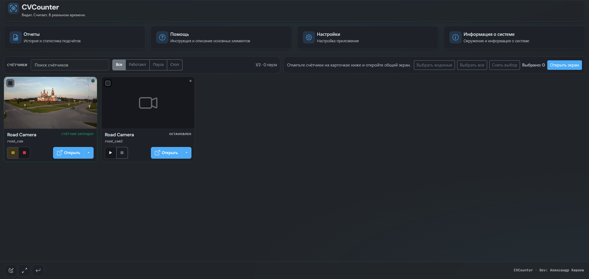
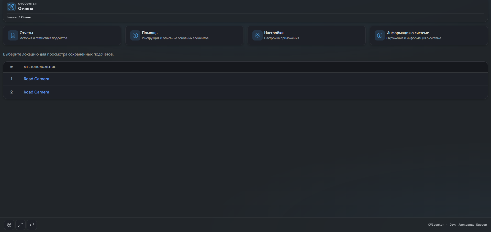
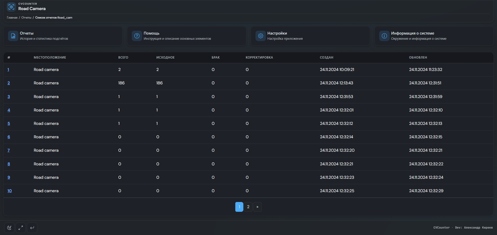
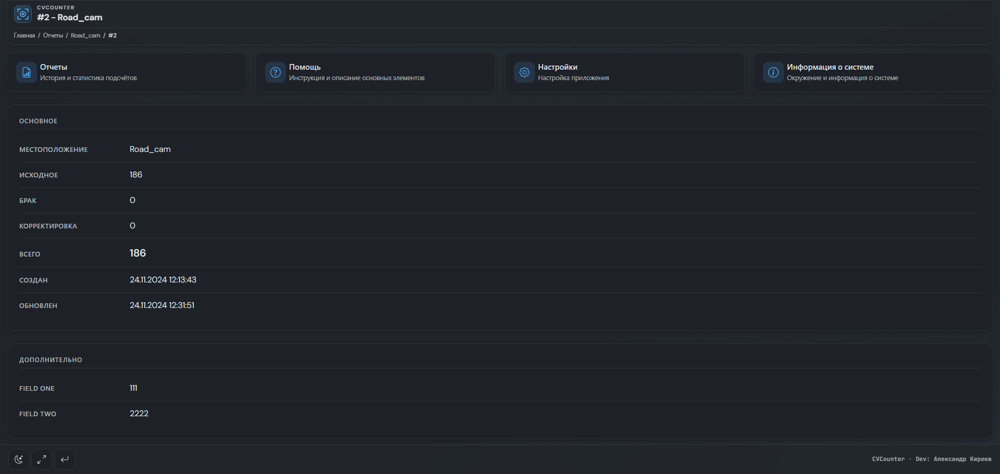
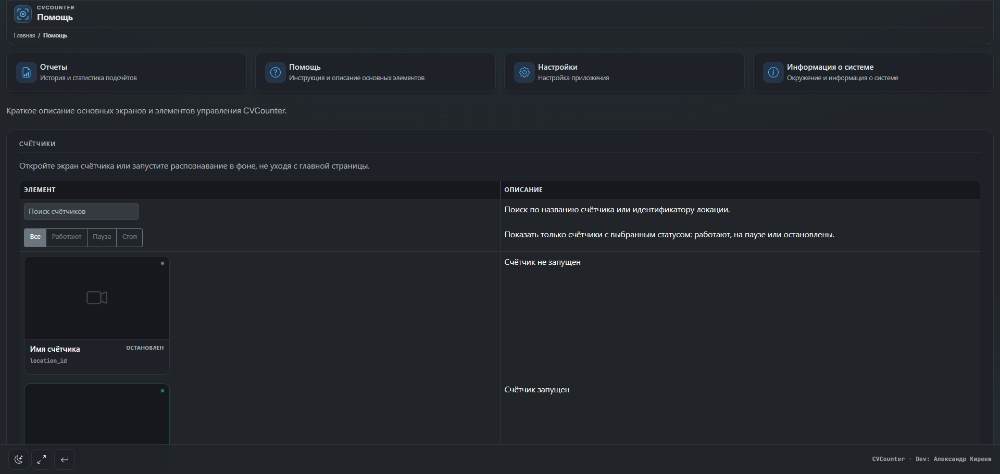
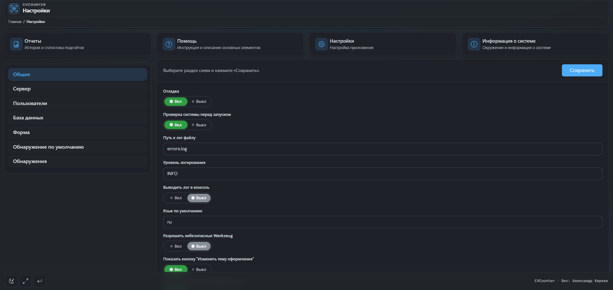
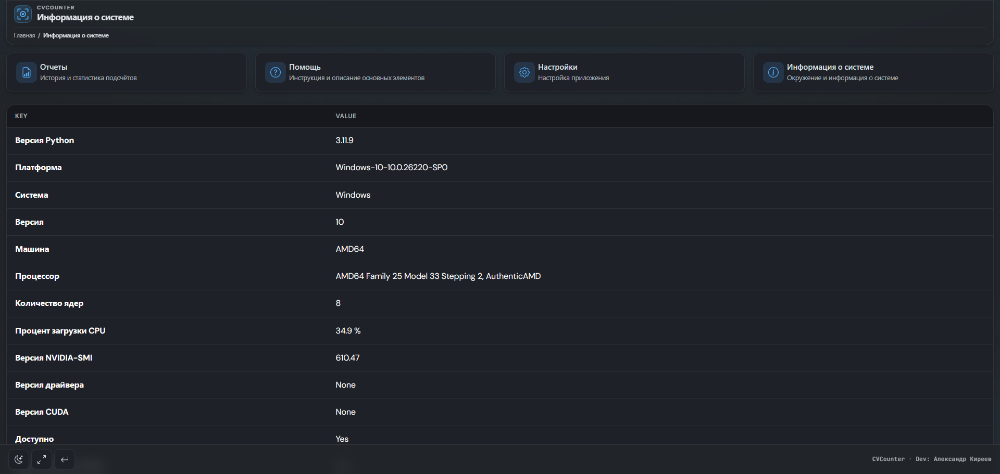
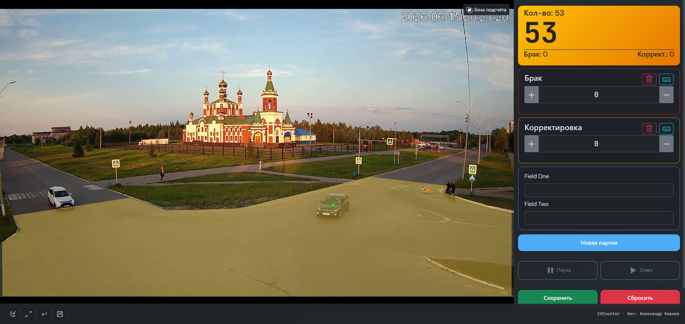
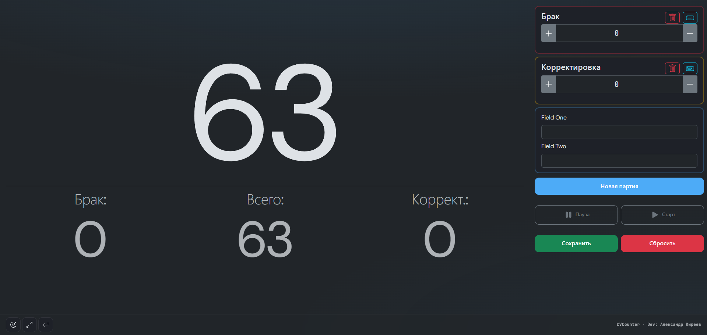
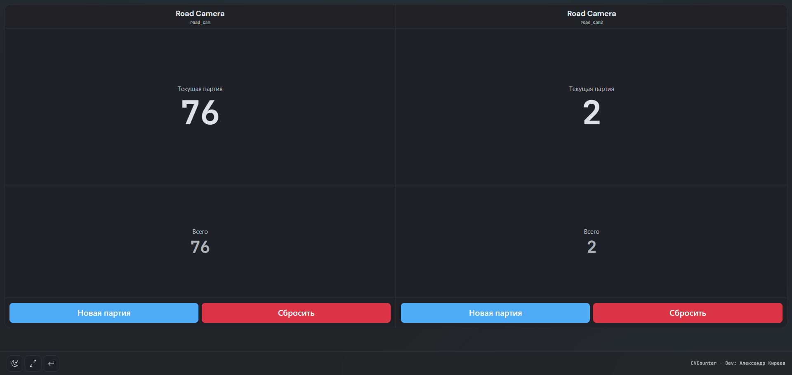
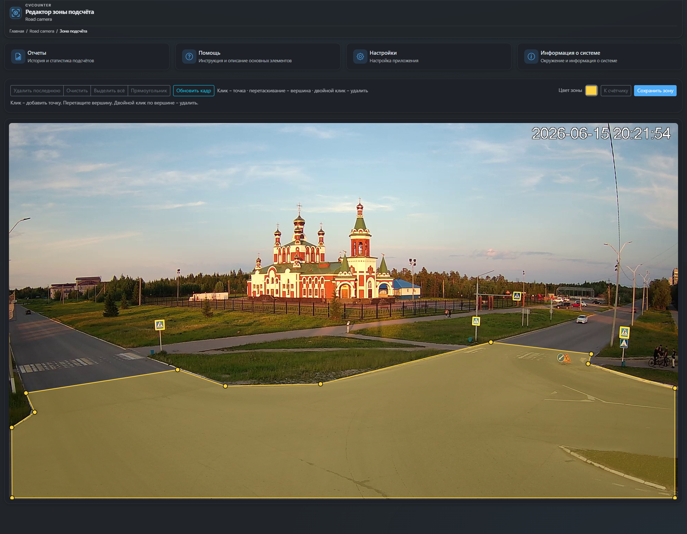
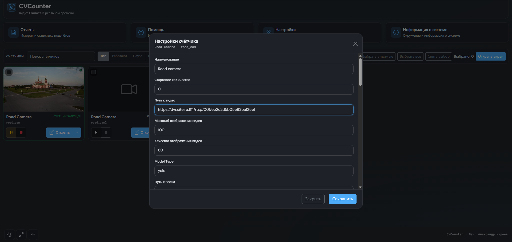

_P.S.: Не лучший пример на скриншотах. Не нашел ничего лучше, чем камера в открытом доступе (((_

---

## 👨‍💻 Автор

Александр Киреев

Website: [https://bespredel.name](https://bespredel.name)<br>
E-mail: [hello@bespredel.name](mailto:hello@bespredel.name)<br>
GitHub: [https://github.com/BespredeL](https://github.com/BespredeL)

---

## 🔗 Ссылки

Ultralytics: [https://github.com/ultralytics](https://github.com/ultralytics)<br>
OpenCV: [https://opencv.org/](https://opencv.org/)<br>
ONNX Runtime: [https://onnxruntime.ai/](https://onnxruntime.ai/)

---

## 📄 Лицензия

**AGPL-3.0 License**: Эта [OSI-approved](https://opensource.org/licenses/) лицензия с открытым исходным кодом идеально подходит для
студентов и энтузиастов, способствуя открытому сотрудничеству и обмену знаниями.

---

## ⭐ Поддержка

Буду признателен за звезду ⭐ на GitHub, если проект оказался полезным.