# CVCounter - Real-Time Object Detection & Counting System

[](https://github.com/BespredeL/CVCounter/blob/master/README_EN.md)
[](https://github.com/BespredeL/CVCounter/blob/master/README.md)
[](https://github.com/BespredeL/CVCounter/blob/master/LICENSE)

🧠 Production-ready computer vision system for real-time object detection, tracking, and counting

CVCounter is a flexible and scalable computer vision solution designed to detect, track, and count objects in real time using video streams.

It is perfectly suited for **counting products, people, vehicle tracking, retail analytics, and surveillance systems.**

---

## ✨ Features

- 🎯 Real-time object detection
- 🔢 Object counting (in zone)
- 🧠 Object tracking (multi-object tracking)
- 🎥 Support for video streams (RTSP, webcam, files)
- ⚡ Optimized for real-time performance
- 📊 Analytics-ready output
- 🧩 Modular architecture with a detector registry
- 🧠 Multiple backends: Ultralytics YOLO, OpenCV DNN, ONNX Runtime

---

## 🚀 Use Cases

- People counting (shops, malls)
- Vehicle counting (traffic analytics)
- Security & surveillance
- Smart city solutions
- Retail analytics
- Industrial monitoring

---

## 🧠 How It Works

1. Video stream is captured
2. Object detection model processes frames
3. Tracker assigns IDs to objects
4. Objects crossing a defined zone are counted
5. Results are stored or displayed

---

## 📦 Installation

### Method 1: Manual Installation

1. **Clone the repository:**
   ```bash
   git clone https://github.com/BespredeL/CVCounter.git
   ```
2. **Navigate to the project directory:**
   ```bash
   cd CVCounter
   ```
3. **Install virtual environment:**
   ```bash
   python3 -m venv venv
   ```
4. **Activate virtual environment:**
    - On Windows:
      ```bash
      .\venv\Scripts\activate
      ```
    - On Linux/Mac:
      ```bash
      source venv/bin/activate
      ```
5. **Install dependencies:**
   ```bash
   pip3 install -r requirements.txt
   ```
6. **Rename the configuration file:**
   ```bash
   mv config/config.example.json config/config.json
   ```
7. **Configure `config/config.json`: set the video source, model path, and detector type (`model_type`).**
8. **Run the application:**
   ```bash
   python app.py
   ```

---

### Method 2: Docker Installation

1. **Clone the repository:**
   ```bash
   git clone https://github.com/BespredeL/CVCounter.git
   ```
2. **Navigate to the project directory:**
   ```bash
   cd CVCounter
   ```
3. **Build and run using Docker Compose:**
   ```bash
   docker-compose up --build
   ```

---

## 🚀 Usage

**This solution implements 3 types of views:**

1. **Main view** - a page displaying the counter values and a video with recognition results
2. **Text view** - a page displaying only the counter values
3. **Text view with N counters** - a page displaying the values of multiple counters (e.g., at the input and output)

After several options, I decided to implement it with Flask, i.e., as a mini website solution, as it allows avoiding the installation of any
additional software on clients. Moreover, this solution is not resource-intensive for clients (except for the main view with video).

I managed to run 6 simultaneous counts (without video output), and 5 counts with video output.

Server specifications:

- AMD Ryzen 5 3600
- GeForce GTX 1050 Ti (4GB)

You can run the browser in kiosk mode to prevent exiting it (for example, for Google Chrome, you can specify "--kiosk --start-fullscreen" at
startup).

**P.S.:**

- Friends, if you don't mind, please don't remove my copyright at the bottom of the page. It doesn't cost you anything, but it makes me
  happy.
- All of this was implemented without any specifications and nobody believed in success, so there is currently some chaos, but I will try to
  redo everything more correctly =)
- If this solution helped you, you can sponsor me by sending the word "Thanks". Contact details are below =)
- If you need help with the implementation, we can discuss it =).

---

## 🧠 Detection Backends

Detectors are registered via `system/object_detection/registry.py`. Set the `model_type` field in the configuration.

| `model_type`           | Backend                                                                  | Model formats                                 |
|------------------------|--------------------------------------------------------------------------|-----------------------------------------------|
| `yolo`                 | [Ultralytics YOLO](https://github.com/ultralytics/ultralytics)           | `.pt`                                         |
| `opencv`, `opencv_dnn` | [OpenCV DNN](https://docs.opencv.org/) | `.onnx`, `.pb`, Darknet (`.weights` + `.cfg`) |
| `onnx`, `onnxruntime`  | [ONNX Runtime](https://onnxruntime.ai/)                                  | `.onnx` (YOLO export)                         |

### Configuration examples

**Ultralytics YOLO (default):**

```json
"model_type": "yolo",
"weights_path": "config/ultralytics/models/yolov8n.pt",
"device": 0
```

**OpenCV DNN + ONNX:**

```json
"model_type": "opencv",
"weights_path": "config/opencv/models/yolov8n.onnx",
"input_size": 640,
"backend": "CUDA",
"target": "CUDA"
```

**Darknet via OpenCV:**

```json
"model_type": "opencv_dnn",
"weights_path": "config/opencv_dnn/models/yolov4.weights",
"model_config_path": "config/opencv_dnn/models/yolov4.cfg",
"input_size": 416
```

**ONNX Runtime:**

```json
"model_type": "onnx",
"weights_path": "config/onnx/models/yolov8n.onnx",
"input_size": 640,
"providers": [
"CUDAExecutionProvider", "CPUExecutionProvider"
]
```

Export YOLO model to ONNX:

```bash
yolo export model=config/ultralytics/models/yolov8n.pt format=onnx
```

### Optional detection parameters

| Parameter           | Applies to     | Description                                             |
|---------------------|----------------|---------------------------------------------------------|
| `weights_path`      | all            | Path to the model file                                  |
| `model_config_path` | OpenCV Darknet | Path to `.cfg`                                          |
| `input_size`        | OpenCV, ONNX   | Input size: integer or `[width, height]`, default `640` |
| `backend`           | OpenCV         | `OPENCV`, `CUDA`, `DEFAULT`, etc.                       |
| `target`            | OpenCV         | `CPU`, `CUDA`, `CUDA_FP16`, etc.                        |
| `providers`         | ONNX           | ONNX Runtime provider list                              |
| `confidence`, `iou` | all            | Detection thresholds                                    |
| `device`            | YOLO, ONNX     | Device (`0`, `cpu`, etc.)                               |
| `vid_stride`        | YOLO           | Frame stride during inference                           |
| `classes`           | all            | Class filter `{ "0": "person" }`                        |

### Adding a custom detector

1. Create a class that inherits from `BaseObjectDetectionService`:

```python
from system.object_detection.base_object_detection import BaseObjectDetectionService, DetectionResult
from system.object_detection.registry import register


@register('my_detector')
class ObjectDetectionMy(BaseObjectDetectionService):
    def load_model(self, weights: str, **kwargs) -> None:
        ...

    def detect(self, image, **kwargs) -> DetectionResult:
        # return boxes_xyxy, confidences, classes
        ...
```

2. Import the module in `system/object_detection/__init__.py`.
3. Set `"model_type": "my_detector"` in the configuration.

---

## ⚙️ Configuration

```json5
{
    general: {
        // enable debug mode
        debug: true,
        // path to log file
        log_path: "storage/logs/cvcounter.log",
        // minimal log level: DEBUG, INFO, WARNING, ERROR, CRITICAL
        log_level: "INFO",
        // enable console log output (recommended false in production)
        log_console: false,
        // default language
        default_language: "ru",
        // allow unsafe operations in werkzeug
        allow_unsafe_werkzeug: false,
        // show button changing theme
        button_change_theme: true,
        // show button fullscreen
        button_fullscreen: true,
        // show back button
        button_backward: false,
        // show save capture button
        button_save_capture: false,
        // show collapsed keyboard
        collapsed_keyboard: true,
    },
    server: {
        // server host
        host: "0.0.0.0",
        // server port
        port: 8080,
        // enable reloader mode
        use_reloader: false,
        // enable log output
        log_output: true,
        // socketio key
        socketio_key: "",
        // allowed origins
        allowed_origins: "*",
    },
    users: {
        // login:password default admin:admin
        admin: "scrypt:32768:8:1$rsdPYhqaQqpXQQ0o$aa3359c86228b4cee5fe8c4ed694db4b371fa7fab5100fa7b446db7e1ed8077e3bb63228d4a1899aeeef9b8d15f8e8bdbcc3457f020bcb3ec320332c76b5896b",
    },
    db: {
        // database connection
        uri: "sqlite:///system/database.db",
        // table prefix
        prefix: "",
    },
    form: {
        // show defect form
        defect_show: true,
        // show correction form
        correct_show: true,
        // custom fields configuration
        custom_fields: {
            field_one: {
                // field name
                name: "field_one",
                // field signature
                label: "Field One",
                // field type
                type: "text",
            },
        },
    },
    detection_default: {
        // model type: yolo | opencv | opencv_dnn | onnx | onnxruntime
        model_type: "yolo",
        // path to model (.pt, .onnx, .weights, etc.)
        weights_path: "config/ultralytics/models/yolov8n.pt",
        // Darknet config path (.cfg), for opencv/opencv_dnn only
        // model_config_path: "config/models/yolov4.cfg",
        // model input size (integer or [width, height]), for opencv/onnx
        // input_size: 640,
        // OpenCV DNN backend/target (OPENCV, CUDA, CPU, etc.)
        // backend: "CUDA",
        // target: "CUDA",
        // ONNX Runtime providers
        // providers: ["CUDAExecutionProvider", "CPUExecutionProvider"],
        // scale of video preview
        video_show_scale: 50,
        // quality of video preview
        video_show_quality: 50,
        // manual FPS setting (0 - automatic installation)
        video_fps: 0,
        // confidence threshold
        confidence: 0.7,
        // iou threshold
        iou: 0.7,
        // computing device (see ultralytics / ONNX Runtime docs)
        device: 0,
        // video stream stride
        vid_stride: 1,
        // size of indicator
        indicator_size: 10,
        // counting area polygon
        counting_area: [
            [
                0,
                0
            ],
            [
                100,
                0
            ],
            [
                100,
                100
            ],
            [
                0,
                100
            ],
        ],
        // color of counting area
        counting_area_color: [
            67,
            211,
            255
        ],
        // classes to detect (leave empty for all classes)
        classes: {},
        // video recording configuration for all recognitions
        recording: {
            // enable video recording
            enable: false,
            // path to storage folder
            path: "storage/saved_recordings",
            // video size (percentage)
            scale: 100,
            // video quality
            quality: 80,
        },
    },
    detections: {
        // detection configs
        ExampleCam: {
            // name
            label: "Label ExampleCam",
            // label
            start_total_count: 0,
            // start total count
            video_path: "",
            // path to video file or camera src
            video_show_scale: 70,
            // scale of video preview
            video_show_quality: 30,
            // quality of video preview
            video_fps: 0,
            // manual FPS setting (optional)
            // model type: yolo | opencv | opencv_dnn | onnx | onnxruntime
            model_type: "yolo",
            // path to model Yolov8
            weights_path: "config/ultralytics/models/yolov8n.pt",
            confidence: 0.7,
            // confidence threshold
            iou: 0.7,
            // iou threshold
            device: 0,
            // computing device (see ultralytics / ONNX Runtime docs)
            vid_stride: 1,
            // video stream stride
            indicator_size: 10,
            // size of indicator
            counting_area: [
                [
                    0,
                    0
                ],
                [
                    100,
                    0
                ],
                [
                    100,
                    100
                ],
                [
                    0,
                    100
                ],
            ],
            // counting area polygon
            counting_area_color: [
                255,
                64,
                0
            ],
            // color of counting area
            classes: {},
            // classes to detect (leave empty for all classes)
            dataset_create: {
                // automatic dataset creation
                enable: true,
                // enable dataset creation
                probability: 0.05,
                // probability of creating a dataset image (number from 0.01 to 1, where 0.01 is 1% and 1 is 100%)
                path: "storage/saved_images/ExampleCam",
                // path for saving dataset
            },
            // detection video recording configuration
            recording: {
                // enable video recording
                enable: false,
                // path to storage folder
                path: "storage/saved_recordings",
                // video size (percentage)
                scale: 100,
                // video quality
                quality: 80,
            },
        },
    },
}
```

---

## 📸 Screenshots

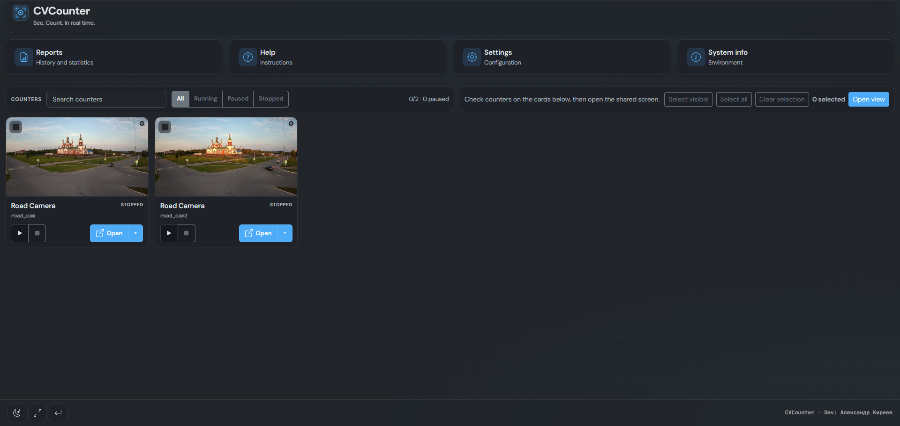
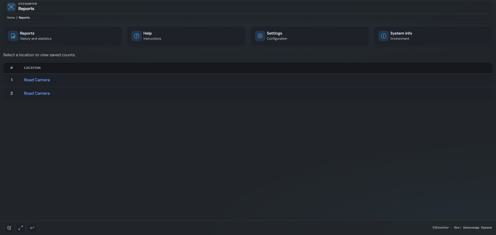
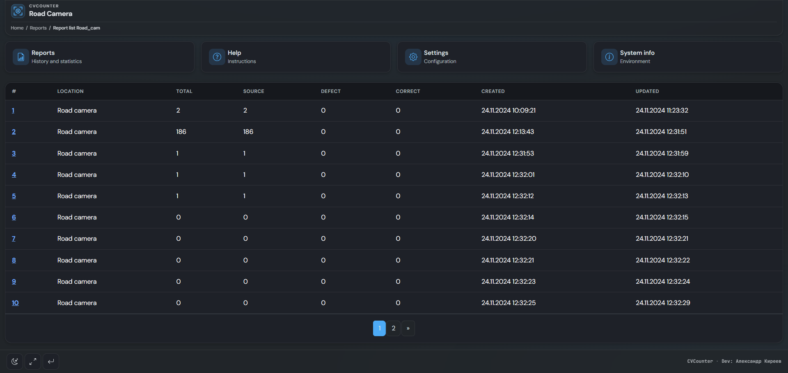
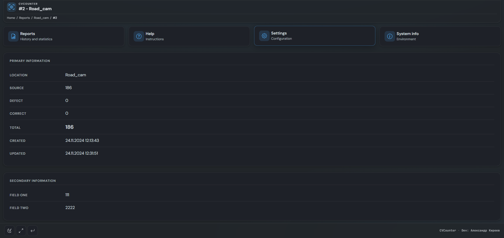
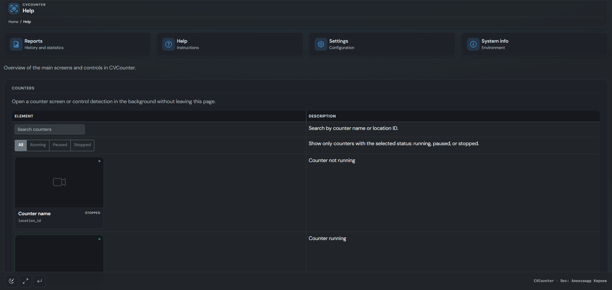
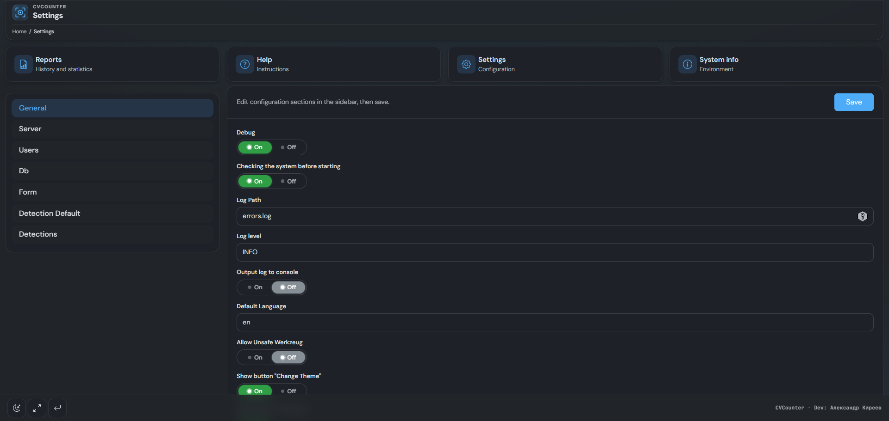
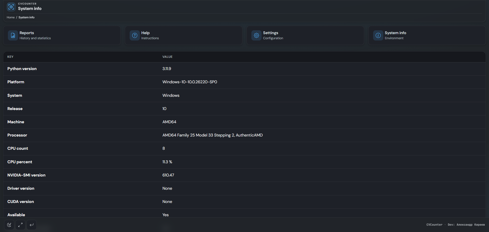
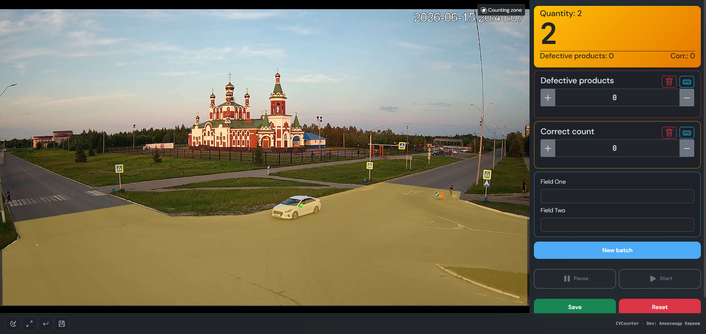
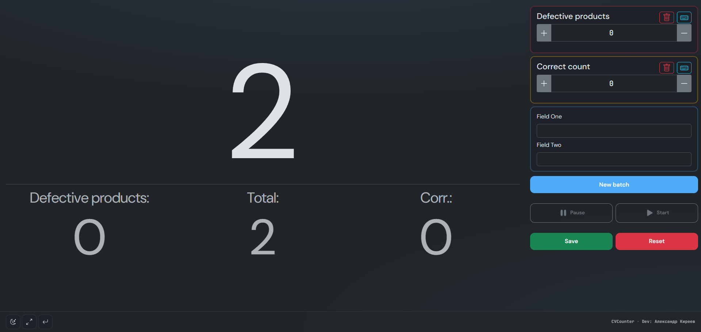
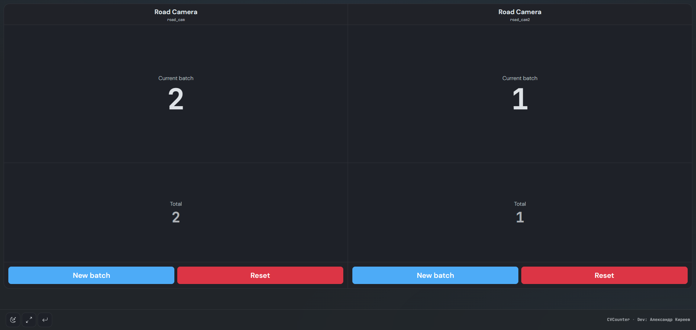
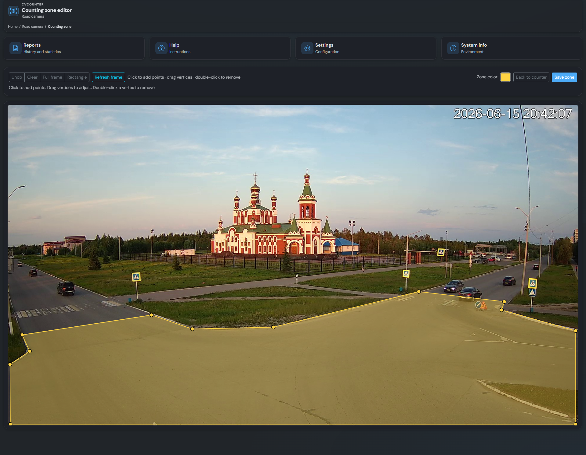
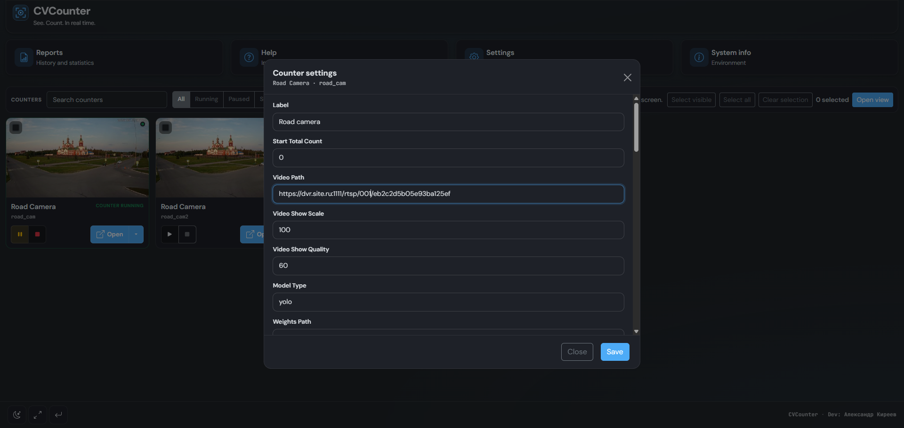

_P.S.: Not the best example in the screenshots. Couldn't find anything better than an open-access camera (((_

---

## 👨‍💻 Author

Aleksandr Kireev

Website: [https://bespredel.name](https://bespredel.name)<br>
E-mail: [hello@bespredel.name](mailto:hello@bespredel.name)<br>
GitHub: [https://github.com/BespredeL](https://github.com/BespredeL)

---

## 🔗 Links

Ultralytics: [https://github.com/ultralytics](https://github.com/ultralytics)<br>
OpenCV: [https://opencv.org/](https://opencv.org/)<br>
ONNX Runtime: [https://onnxruntime.ai/](https://onnxruntime.ai/)

---

## 📄 License

**AGPL-3.0 License**: This [OSI-approved](https://opensource.org/licenses/) open-source license is ideal for students and enthusiasts,
promoting open collaboration and knowledge sharing.

---

## ⭐ Support

If you find this project useful, give it a star ⭐