# CVCounter - Real-Time Object Detection & Counting System

[](https://bespredel.github.io/cvcounter/)
[](https://github.com/BespredeL/CVCounter/blob/master/README_EN.md)
[](https://github.com/BespredeL/CVCounter/blob/master/README.md)
[](https://github.com/BespredeL/CVCounter/blob/master/LICENSE)

🧠 Production-ready computer vision system for real-time object detection, tracking, and counting

CVCounter is a flexible and scalable computer vision solution designed to detect, track, and count objects in real time
using video streams.

It is perfectly suited for **counting products, people, vehicle tracking, retail analytics, and surveillance systems.**

---

## ✨ Features

- 🎯 Real-time object detection
- 🔢 Object counting in one or more zones
- 🏷️ Per-class count breakdown (current batch / total)
- 🧠 Object tracking (multi-object tracking)
- 🎥 Support for video streams (RTSP, webcam, files)
- 🎬 Detection-triggered video recording with `idle_timeout` stop
- 📚 Datasets: import, annotate, train YOLO, and apply weights to a counter
- ⚡ Optimized for real-time performance
- 📊 Analytics-ready reports with per-class totals and saved media playback
- 🧩 Modular architecture with detector registry and auto-detection by file extension (`auto`)
- 🧠 Multiple backends: ONNX Runtime, OpenVINO, OpenCV DNN, Ultralytics YOLO / TensorRT
- 🔐 Session login for settings, datasets, and admin actions
- 📡 Optional anonymized telemetry (errors/usage) and manual diagnostics

> **Help improve CVCounter**  
> If you can, please enable telemetry (`telemetry.enabled: true` in Settings).  
> Anonymized error and usage data helps find issues faster and improve the app. Thank you!  
> Frames, camera URLs, and the full config are **never sent**. Manual diagnostics are available on the **System info**
> page (account login). Details: [`docs/telemetry_api.md`](docs/telemetry_api.md).

---

## 🚀 Use Cases

- People counting (shops, malls)
- Vehicle counting (traffic analytics)
- Security & surveillance
- Smart city solutions
- Retail analytics
- Industrial monitoring

---

## 🧠 How It Works

1. Video stream is captured
2. Object detection model processes frames
3. Tracker assigns IDs to objects
4. Objects entering any counting zone are counted
5. Totals, batches, and per-class breakdown are shown and can be saved to reports

---

## 📦 Installation

### Method 1: Manual Installation

1. **Clone the repository:**
   ```bash
   git clone https://github.com/BespredeL/CVCounter.git
   ```
2. **Navigate to the project directory:**
   ```bash
   cd CVCounter
   ```
3. **Install virtual environment:**
   ```bash
   python3 -m venv venv
   ```
4. **Activate virtual environment:**
    - On Windows:
      ```bash
      .\venv\Scripts\activate
      ```
    - On Linux/Mac:
      ```bash
      source venv/bin/activate
      ```
5. **Install core dependencies:**
   ```bash
   pip3 install -r requirements.txt
   ```
   *(Optional)* For `.pt` models and training with Ultralytics:
   ```bash
   pip3 install -r requirements-ultralytics.txt
   ```
   *(Optional)* For Intel OpenVINO hardware acceleration:
   ```bash
   pip3 install -r requirements-openvino.txt
   ```
6. **Rename the configuration file:**
   ```bash
   mv config/config.example.json config/config.json
   ```
7. **Configure `config/config.json`: set video source, model path, and `model_type` (`auto` by default).**
8. **Run the application:**
   ```bash
   python app.py
   ```

---

### Method 2: Docker Installation

1. **Clone the repository:**
   ```bash
   git clone https://github.com/BespredeL/CVCounter.git
   ```
2. **Navigate to the project directory:**
   ```bash
   cd CVCounter
   ```
3. **Build and run using Docker Compose:**
   ```bash
   docker-compose up --build
   ```

---

## 🚀 Usage

**This solution provides the following modes:**

1. **Main view** — counter values and video with recognition results
2. **Text view** — counter values only (lower client load)
3. **Multi view** — several counters on one page (batch, total, per-class breakdown)
4. **Datasets** — import frames, annotate, train YOLO, apply `best.pt` to a counter
5. **Reports** — count history and saved media (frames / recordings)

After several options, I decided to implement it with Flask, i.e., as a mini website solution, as it allows avoiding the
installation of any
additional software on clients. Moreover, this solution is not resource-intensive for clients (except for the main view
with video).

I managed to run 6 simultaneous counts (without video output), and 5 counts with video output.

Server specifications:

- AMD Ryzen 5 3600
- GeForce GTX 1050 Ti (4GB)

You can run the browser in kiosk mode to prevent exiting it (for example, for Google Chrome, you can specify "--kiosk
--start-fullscreen" at
startup).

**P.S.:**

- Friends, if you don't mind, please don't remove my copyright at the bottom of the page. It doesn't cost you anything,
  but it makes me
  happy.
- All of this was implemented without any specifications and nobody believed in success, so there is currently some
  chaos, but I will try to
  redo everything more correctly =)
- If this solution helped you, you can sponsor me by sending the word "Thanks". Contact details are below =)
- If you need help with the implementation, we can discuss it =).

---

## 📚 Datasets and Training

Web **Datasets** section:

1. Create a dataset and import frames (camera / upload / ZIP / recordings)
2. Annotate with boxes or polygons (optional Track ID and attributes)
3. Train model from the UI
4. Apply `best.pt` to the chosen counter

In-app training runs through `system.training` / `TrainingJobManager`.

For auto-capture into a dataset inbox, set `dataset_create.path` to:
`storage/datasets/<name>/images/inbox` (shown on the dataset page).

Optional offline CLI:

```bash
python train.py list
python train.py train --config road-cam-test --epochs 100
python train.py export --config road-cam-test --export onnx
```

Details: [docs/wiki.md](docs/wiki.md).

---

## 🧠 Detection Backends

Detectors are registered via `system/object_detection/registry.py`. Set the `model_type` field in the configuration (or use `"auto"` for automatic format detection).

| `model_type`             | Backend                                                        | License     | Model formats                                 |
|--------------------------|----------------------------------------------------------------|-------------|-----------------------------------------------|
| `auto` (default)         | Automatic backend selection based on file extension            | —           | `.onnx`, `.engine`, `.xml`, `.pt`, `.weights` |
| `onnx`, `onnxruntime`    | [ONNX Runtime](https://onnxruntime.ai/)                        | MIT         | `.onnx` (YOLOv5–v11, YOLOv10, RT-DETR)        |
| `openvino`, `openvino_dnn`| [Intel OpenVINO](https://www.intel.com/openvino)              | Apache-2.0  | `.xml`/`.bin`, `.onnx`                        |
| `opencv`, `opencv_dnn`   | [OpenCV DNN](https://docs.opencv.org/)                         | Apache-2.0  | `.onnx`, `.pb`, Darknet (`.weights` + `.cfg`) |
| `yolo`, `ultralytics`    | [Ultralytics YOLO](https://github.com/ultralytics/ultralytics) | AGPL-3.0    | `.pt`, TensorRT `.engine`                     |

### Configuration examples

**Automatic selection (recommended):**

```json
"model_type": "auto",
"weights_path": "config/ultralytics/models/yolo11n.onnx"
```

**ONNX Runtime (high performance, cross-platform):**

```json
"model_type": "onnx",
"weights_path": "config/ultralytics/models/yolo11n.onnx",
"input_size": 640,
"providers": [
  "CUDAExecutionProvider",
  "CPUExecutionProvider"
]
```

**Intel OpenVINO (optimized for CPU, iGPU, Arc, NPU):**

```json
"model_type": "openvino",
"weights_path": "config/models/yolo11n.onnx",
"device": "CPU"
```

**Ultralytics YOLO / TensorRT Engine:**

```json
"model_type": "yolo",
"weights_path": "config/ultralytics/models/yolo11n.engine",
"device": 0
```

**Darknet via OpenCV:**

```json
"model_type": "opencv_dnn",
"weights_path": "config/opencv_dnn/models/yolov4.weights",
"model_config_path": "config/opencv_dnn/models/yolov4.cfg",
"input_size": 416
```

Export YOLO model to ONNX:

```bash
yolo export model=config/ultralytics/models/yolov8n.pt format=onnx
```

### Optional detection parameters

| Parameter           | Applies to     | Description                                                          |
|---------------------|----------------|----------------------------------------------------------------------|
| `weights_path`      | all            | Path to the model file                                               |
| `model_config_path` | OpenCV Darknet | Path to `.cfg`                                                       |
| `input_size`        | OpenCV, ONNX, OpenVINO | Input size: integer or `[width, height]`, auto-detected or `640` |
| `backend`           | OpenCV         | `OPENCV`, `CUDA`, `DEFAULT`, etc.                                    |
| `target`            | OpenCV         | `CPU`, `CUDA`, `CUDA_FP16`, etc.                                     |
| `providers`         | ONNX           | ONNX Runtime provider list (`CUDAExecutionProvider`, `CPUExecutionProvider`) |
| `confidence`, `iou` | all            | Detection thresholds                                                 |
| `device`            | YOLO, ONNX, OpenVINO | Device (`0`, `cpu`, `GPU`, `AUTO`, etc.)                        |
| `vid_stride`        | YOLO           | Frame stride during inference                                        |
| `classes`           | all            | Class filter and UI labels `{ "0": "person" }` (shown in "By class") |

### Adding a custom detector

1. Create a class that inherits from `BaseObjectDetectionService`:

```python
from system.object_detection.base_object_detection import BaseObjectDetectionService, DetectionResult
from system.object_detection.registry import register


@register('my_detector')
class ObjectDetectionMy(BaseObjectDetectionService):
    def load_model(self, weights: str, **kwargs) -> None:
        ...

    def detect(self, image, **kwargs) -> DetectionResult:
        # return boxes_xyxy, confidences, classes
        ...
```

2. Import the module in `system/object_detection/__init__.py`.
3. Set `"model_type": "my_detector"` in the configuration.

---

## ⚙️ Configuration

```json5
{
    general: {
        // enable debug mode
        debug: true,
        // path to log file
        log_path: "storage/logs/cvcounter.log",
        // minimal log level: DEBUG, INFO, WARNING, ERROR, CRITICAL
        log_level: "INFO",
        // enable console log output (recommended false in production)
        log_console: false,
        // default language
        default_language: "ru",
        // allow unsafe operations in werkzeug
        allow_unsafe_werkzeug: false,
        // show button changing theme
        button_change_theme: true,
        // show button fullscreen
        button_fullscreen: true,
        // show back button
        button_backward: false,
        // show save capture button
        button_save_capture: false,
        // show collapsed keyboard
        collapsed_keyboard: true,
    },
    server: {
        // server host
        host: "0.0.0.0",
        // server port
        port: 8080,
        // enable reloader mode
        use_reloader: false,
        // enable log output
        log_output: true,
        // socketio key
        socketio_key: "",
        // allowed origins
        allowed_origins: "*",
    },
    users: {
        // login:password default admin:admin
        admin: "scrypt:32768:8:1$rsdPYhqaQqpXQQ0o$aa3359c86228b4cee5fe8c4ed694db4b371fa7fab5100fa7b446db7e1ed8077e3bb63228d4a1899aeeef9b8d15f8e8bdbcc3457f020bcb3ec320332c76b5896b",
    },
    db: {
        // database connection
        uri: "sqlite:///system/database.db",
        // table prefix
        prefix: "",
    },
    telemetry: {
        // automatic sending is off by default
        enabled: false,
        // receiver URL on your website
        endpoint: "https://bespredel.name/api/cvcounter/telemetry",
        // include exception events
        send_errors: true,
        // include usage events
        send_usage: true,
        // background flush interval (sec)
        flush_interval_sec: 300,
        // queue/batch limits (keep telemetry off the hot path)
        max_batch_size: 50,
        max_queue_size: 200,
        max_stack_chars: 8000,
        error_dedup_sec: 120,
        // HTTP timeout (sec)
        timeout_sec: 5,
        // optional HMAC secret for request body signature
        hmac_secret: "",
    },
    form: {
        // show defect form
        defect_show: true,
        // show correction form
        correct_show: true,
        // custom fields configuration
        custom_fields: {
            field_one: {
                // field name
                name: "field_one",
                // field signature
                label: "Field One",
                // field type
                type: "text",
            },
        },
    },
    detection_default: {
        // model type: yolo | opencv | opencv_dnn | onnx | onnxruntime
        model_type: "yolo",
        // path to model (.pt, .onnx, .weights, etc.)
        weights_path: "config/ultralytics/models/yolov8n.pt",
        // Darknet config path (.cfg), for opencv/opencv_dnn only
        // model_config_path: "config/models/yolov4.cfg",
        // model input size (integer or [width, height]), for opencv/onnx
        // input_size: 640,
        // OpenCV DNN backend/target (OPENCV, CUDA, CPU, etc.)
        // backend: "CUDA",
        // target: "CUDA",
        // ONNX Runtime providers
        // providers: ["CUDAExecutionProvider", "CPUExecutionProvider"],
        // scale of video preview
        video_show_scale: 50,
        // quality of video preview
        video_show_quality: 50,
        // manual FPS setting (0 - automatic installation)
        video_fps: 0,
        // max camera connection attempts on start and after stream loss
        video_reconnect_attempts: 5,
        // confidence threshold
        confidence: 0.7,
        // iou threshold
        iou: 0.7,
        // computing device (see ultralytics / ONNX Runtime docs)
        device: 0,
        // video stream stride
        vid_stride: 1,
        // size of indicator
        indicator_size: 10,
        // counting zones (preferred; one or more polygons)
        counting_areas: [
            {
                points: [
                    [
                        0,
                        0
                    ],
                    [
                        100,
                        0
                    ],
                    [
                        100,
                        100
                    ],
                    [
                        0,
                        100
                    ]
                ],
                color: [
                    67,
                    211,
                    255
                ],
                // BGR
            },
        ],
        // legacy: first zone (kept in sync when saving from the zone editor)
        counting_area: [
            [
                0,
                0
            ],
            [
                100,
                0
            ],
            [
                100,
                100
            ],
            [
                0,
                100
            ]
        ],
        counting_area_color: [
            67,
            211,
            255
        ],
        // classes to detect and labels for the "By class" UI (empty = all classes)
        // example: { "0": "Product 1", "1": "Product 2" }
        classes: {},
        // video recording configuration for all recognitions
        recording: {
            // enable video recording
            enable: false,
            // path to storage folder
            path: "storage/saved_recordings",
            // video size (percentage)
            scale: 100,
            // video quality
            quality: 80,
            // seconds without detections before stopping recording (0 = keep until counter reset)
            // recording starts when objects are detected
            idle_timeout: 30,
        },
    },
    detections: {
        // detection configs
        ExampleCam: {
            // name
            label: "Label ExampleCam",
            // label
            start_total_count: 0,
            // start total count
            video_path: "",
            // path to video file or camera src
            video_show_scale: 70,
            // scale of video preview
            video_show_quality: 30,
            // quality of video preview
            video_fps: 0,
            // manual FPS setting (optional)
            // max camera connection attempts (optional, inherits from detection_default)
            video_reconnect_attempts: 5,
            // model type: yolo | opencv | opencv_dnn | onnx | onnxruntime
            model_type: "yolo",
            // path to model Yolov8
            weights_path: "config/ultralytics/models/yolov8n.pt",
            confidence: 0.7,
            // confidence threshold
            iou: 0.7,
            // iou threshold
            device: 0,
            // computing device (see ultralytics / ONNX Runtime docs)
            vid_stride: 1,
            // video stream stride
            indicator_size: 10,
            // counting zones (object is counted when entering any zone)
            counting_areas: [
                {
                    points: [
                        [
                            0,
                            0
                        ],
                        [
                            100,
                            0
                        ],
                        [
                            100,
                            100
                        ],
                        [
                            0,
                            100
                        ]
                    ],
                    color: [
                        255,
                        64,
                        0
                    ],
                },
            ],
            counting_area: [
                [
                    0,
                    0
                ],
                [
                    100,
                    0
                ],
                [
                    100,
                    100
                ],
                [
                    0,
                    100
                ]
            ],
            counting_area_color: [
                255,
                64,
                0
            ],
            // classes to detect and labels for the per-class breakdown
            classes: {},
            dataset_create: {
                // automatic dataset creation
                enable: true,
                // enable dataset creation
                probability: 0.05,
                // probability of creating a dataset image (number from 0.01 to 1, where 0.01 is 1% and 1 is 100%)
                path: "storage/datasets/ExampleCam/images/inbox",
                // for Datasets UI inbox: storage/datasets/<name>/images/inbox
            },
            // detection video recording configuration
            recording: {
                // enable video recording
                enable: false,
                // path to storage folder
                path: "storage/saved_recordings",
                // video size (percentage)
                scale: 100,
                // video quality
                quality: 80,
                // seconds without detections before stopping recording (0 = until reset)
                // recording starts on detection, not continuously from counter start
                idle_timeout: 15,
            },
        },
    },
}
```

---

## 📸 Screenshots

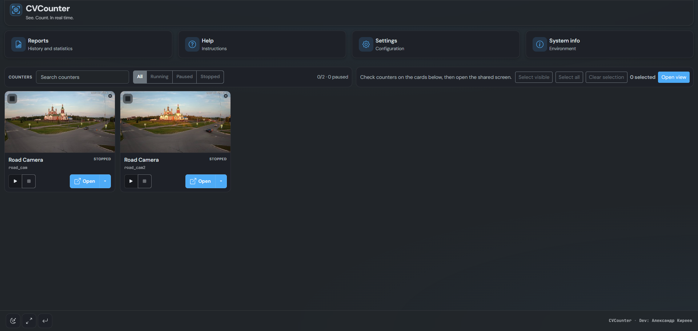
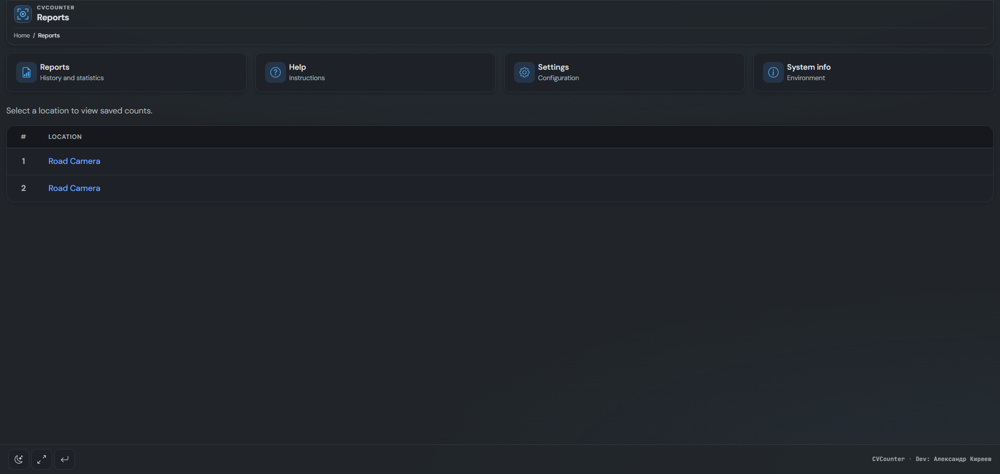
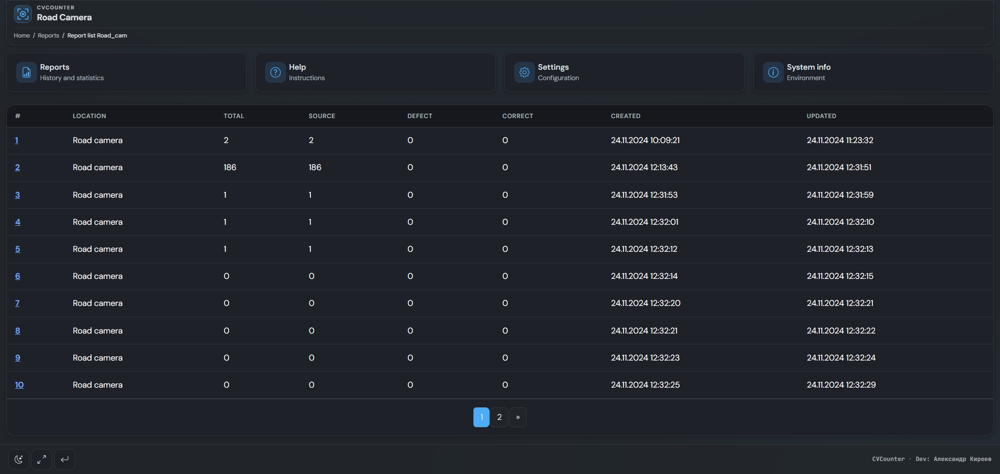
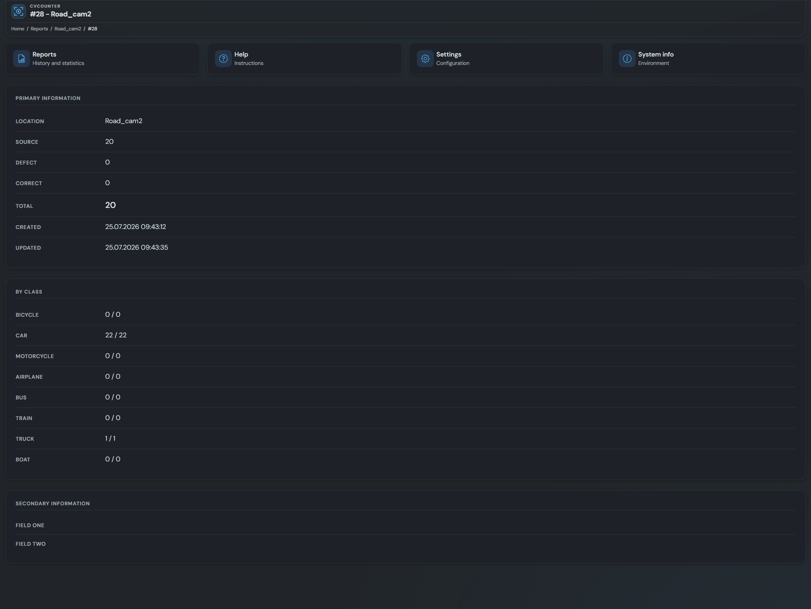
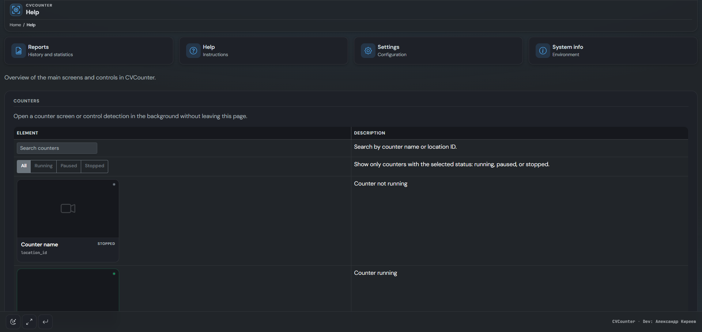
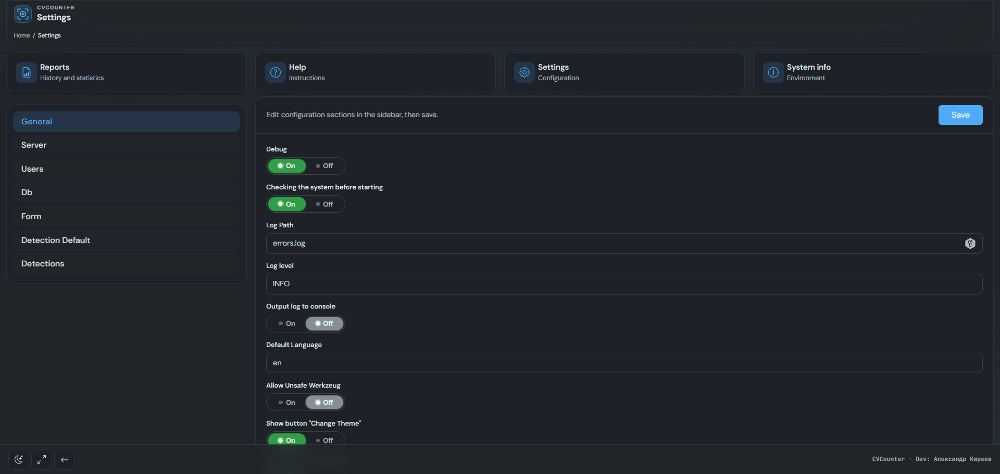
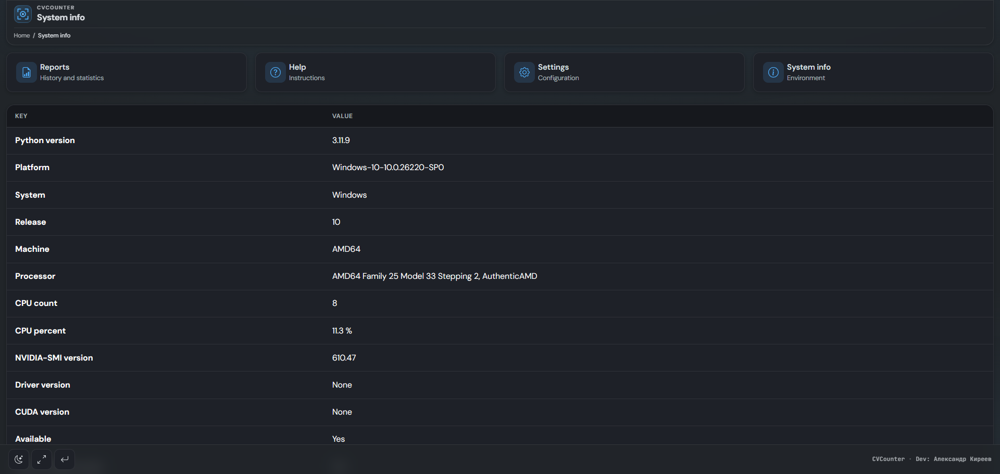
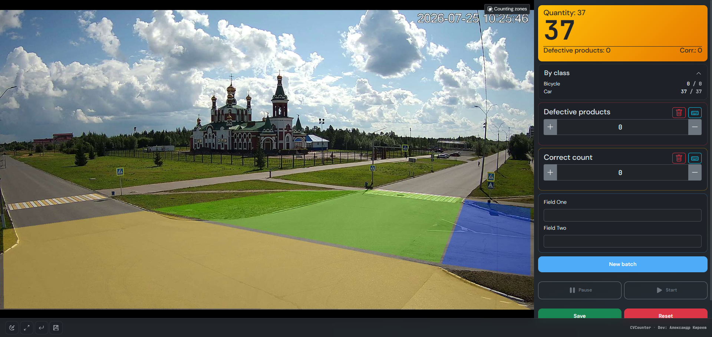
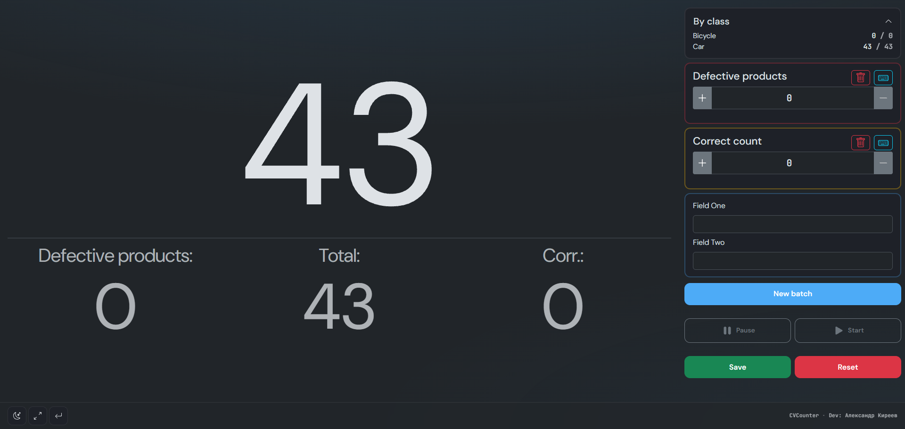
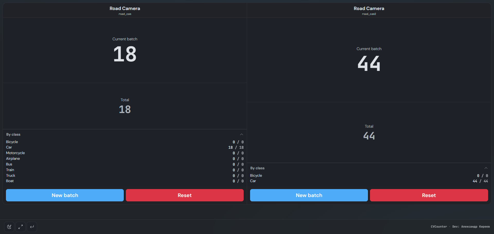
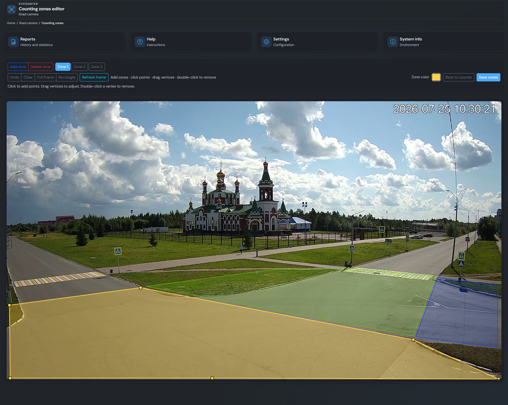
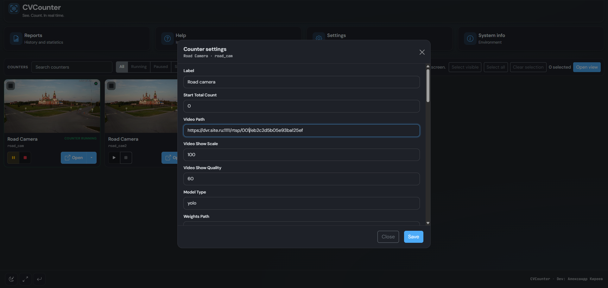

_P.S.: Not the best example in the screenshots. Couldn't find anything better than an open-access camera (((_

---

## 👨‍💻 Author

Aleksandr Kireev

Website: [https://bespredel.name](https://bespredel.name)<br>
E-mail: [hello@bespredel.name](mailto:hello@bespredel.name)<br>
GitHub: [https://github.com/BespredeL](https://github.com/BespredeL)

---

## 🔗 Links

Website: [https://cvcounter.github.io/](https://cvcounter.github.io/)<br>
Telemetry API docs: [docs/telemetry_api.md](docs/telemetry_api.md)<br>
Wiki (EN): [docs/wiki.md](docs/wiki.md)<br>
Ultralytics: [https://github.com/ultralytics](https://github.com/ultralytics)<br>
OpenCV: [https://opencv.org/](https://opencv.org/)<br>
ONNX Runtime: [https://onnxruntime.ai/](https://onnxruntime.ai/)

---

## 📄 License

**AGPL-3.0 License**: This [OSI-approved](https://opensource.org/licenses/) open-source license is ideal for students
and enthusiasts,
promoting open collaboration and knowledge sharing.

---

## ⭐ Support

If you find this project useful, give it a star ⭐